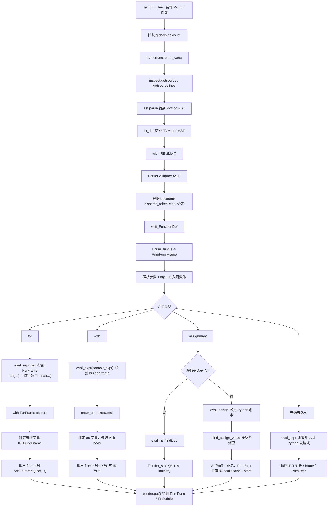
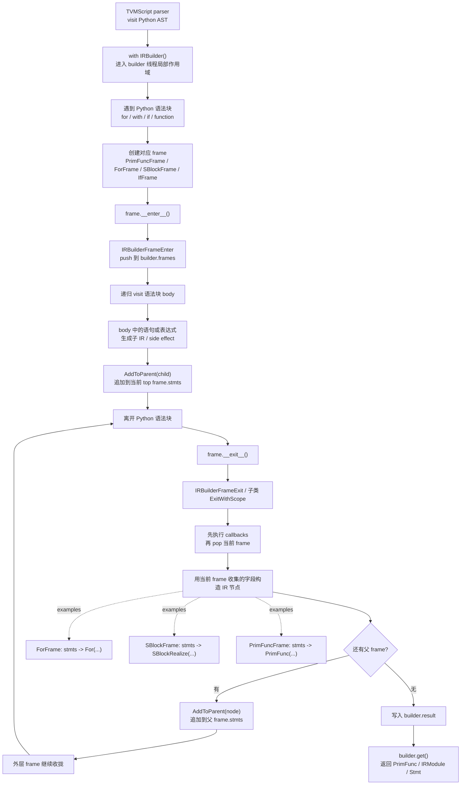

## 5. 第 2 周：TVMScript 入口与 parser/builder/printer

阅读入口：

- `3rdparty/tvm/docs/arch/tvmscript.rst`
- `3rdparty/tvm/python/tvm/script/__init__.py`
- `3rdparty/tvm/python/tvm/script/parser/core/*`
- `3rdparty/tvm/python/tvm/script/ir_builder/base.py`
- `3rdparty/tvm/src/script/ir_builder/*`
- `3rdparty/tvm/src/script/printer/*`
- `3rdparty/tvm/python/tvm/tirx/script/parser/entry.py`
- `3rdparty/tvm/python/tvm/tirx/script/parser/parser.py`
- `3rdparty/tvm/python/tvm/tirx/script/builder/*`

重点问题：

- `from tvm.script import tirx as T` 如何通过 dialect registry 定位到 `tvm.tirx.script`。
- `@T.prim_func` 如何提取 Python AST，并把 `for`、`with`、assignment 变成 IR builder 调用。
- builder frame 的 push/pop 机制如何把 Python 语法块变成 IR 节点。
- `mod.script()` 为什么能反向打印为 TVMScript。

建议实验：

```python
import tvm
from tvm.script import tirx as T

@T.prim_func(s_tir=True)
def add(a: T.handle, b: T.handle, c: T.handle):
    A = T.match_buffer(a, (128,), "float32")
    B = T.match_buffer(b, (128,), "float32")
    C = T.match_buffer(c, (128,), "float32")
    for i in T.serial(128):
        C[i] = A[i] + B[i]

mod = tvm.IRModule({"add": add})
print(mod.script())
```

阶段产出：

- 一份 “`@T.prim_func` 构造 IR 的调用栈”。
- 至少标出 parser、builder、printer 三条路径的核心文件。

# `from tvm.script import tirx as T` 如何通过 dialect registry 定位到 `tvm.tirx.script`

from tvm.script import tirx as T

等价于向模块 tvm.script 要一个名为 tirx 的属性。

关键步骤：

1. tvm.script 先被加载，里面有一个全局 registry：

_DIALECT_REGISTRY = {}

并提供：

def register_dialect(name: str, module_path: str):
    _DIALECT_REGISTRY[name] = module_path

2. tvm.tirx 初始化时注册自己：

import tvm.script
tvm.script.register_dialect("tirx", "tvm.tirx.script")

所以 registry 里会有：

{
    "tirx": "tvm.tirx.script"
}

3. 执行：

from tvm.script import tirx as T时，tvm.script 里没有静态定义 tirx，于是触发模块级 __getattr__：

def __getattr__(name):
    if name in _DIALECT_REGISTRY:
        module = importlib.import_module(_DIALECT_REGISTRY[name])
        globals()[name] = module
        return module

这里 name == "tirx"，查 registry 得到 "tvm.tirx.script"，于是执行：

importlib.import_module("tvm.tirx.script")

4. 返回的模块被绑定给 T：

T = tvm.tirx.script

所以后面：

@T.prim_func
def f(...):
    ...

实际用的是 tvm.tirx.script.prim_func。

一句话概括：

from tvm.script import tirx as T
-> tvm.script.__getattr__("tirx")
-> _DIALECT_REGISTRY["tirx"] == "tvm.tirx.script"
-> import tvm.tirx.script
-> T 指向 tvm.tirx.script

另外，像这种更深的路径：

from tvm.script.parser.tirx.entry import prim_func

单靠 __getattr__ 不够，所以 tvm.script 还装了一个 sys.meta_path finder，把 tvm.script.parser.tirx... 重定向到 tvm.tirx.script.parser...。

# `@T.prim_func` 如何提取 Python AST，并把 `for`、`with`、assignment 变成 IR builder 调用

一句话：`@T.prim_func` 不执行函数体，而是把函数源码解析成 AST；表达式用 Python `eval` 求成 TIR 对象或 builder frame，语句层的 `for`、`with`、assignment 由 TVMScript parser 拦截并翻译成 IRBuilder 调用。



核心文件：

- `3rdparty/tvm/python/tvm/tirx/script/parser/entry.py`：`@T.prim_func` decorator 入口。
- `3rdparty/tvm/python/tvm/script/parser/core/entry.py`：创建 `Source`、`Parser`、`IRBuilder`。
- `3rdparty/tvm/python/tvm/script/parser/core/doc.py`：`ast.parse` 和 Python AST -> `doc.AST`。
- `3rdparty/tvm/python/tvm/tirx/script/parser/parser.py`：`visit_for`、`visit_with`、`visit_assign`。
- `3rdparty/tvm/python/tvm/tirx/script/builder/*` 和 `3rdparty/tvm/src/tirx/script/builder/*`：builder frame 入栈/出栈并生成 IR。

# builder frame 的 push/pop 机制如何把 Python 语法块变成 IR 节点
核心机制是：Python 语法块只提供“进入/退出边界”，真正的 IR 构造发生在 frame 的 ExitWithScope() 里，按栈从内到外自底向上收拢。



  链路大致是：

  1. TVMScript parser 在 3rdparty/tvm/python/tvm/script/parser/core/entry.py:114 里创建 with IRBuilder() as builder，让当前线程能通过
     IRBuilder.current() 找到 builder。

  2. 每个语法块会创建一个 frame。比如 TIR for 在 3rdparty/tvm/python/tvm/tirx/script/parser/parser.py:254 把 range(...) 转成
     T.serial(...) 的 ForFrame，然后 with for_frame as iters: 再递归 visit body。with T.block() 类语法也类似，在 3rdparty/tvm/python/tvm/
     tirx/script/parser/parser.py:579 eval 出 frame 后 enter。

  3. Python frame 的 __enter__/__exit__ 只是 FFI 包装：3rdparty/tvm/python/tvm/script/ir_builder/base.py:68 调 IRBuilderFrameEnter，正常
     退出时调 IRBuilderFrameExit。

  4. C++ 基类 enter 会把 frame push 到 IRBuilder::Current()->frames；基类 exit 会先执行 callbacks，再 pop 当前 frame：3rdparty/tvm/src/
     script/ir_builder/base.cc:34。

  5. 子 frame 的 ExitWithScope() 会在 pop 后，用自己收集到的 body/属性构造 IR 节点，并加到父 frame。比如 ForFrameNode 把 stmts 变成
     For(body=AsStmt(stmts))：3rdparty/tvm/src/tirx/script/builder/frame.cc:232。SBlockFrameNode 构造 SBlock/SBlockRealize：3rdparty/tvm/
     src/tirx/script/builder/frame.cc:173。

  6. “加到父 frame” 的统一入口是 AddToParent：如果还有父 frame，就 append 到父 frame 的 stmts；如果没有父 frame，就设为 builder 的最终
     result：3rdparty/tvm/src/tirx/script/builder/utils.h:38。

  所以以：

  for i in range(10):
      T.evaluate(i)

  为例，parser 进入 ForFrame 后 visit body，body 里的 T.evaluate(i) 被追加到当前 ForFrame.stmts；退出 ForFrame 时，
  ForFrameNode::ExitWithScope() 把这些 stmts 包成 tirx::For，再 append 到外层 frame。外层 frame 退出时重复这个过程，最后
  PrimFuncFrameNode::ExitWithScope() 把函数参数、attrs、AsStmt(stmts) 组装成 PrimFunc，并写入 builder.result 或 IRModule：3rdparty/tvm/
  src/tirx/script/builder/frame.cc:88。

  Relax 也是同一模型，只是 body 收集用 BlockBuilder。例如 BindingBlockFrameNode::ExitWithScope() 会 EndBlock() 得到 BindingBlock，再
  append 到外层 SeqExprFrame.binding_blocks：3rdparty/tvm/src/relax/script/builder/frame.cc:155；FunctionFrameNode::ExitWithScope() 再把
  binding_blocks + output 组装成 SeqExpr 和 relax::Function：3rdparty/tvm/src/relax/script/builder/frame.cc:66。

  一句话：parser 负责把 Python AST 的块结构映射成 frame enter/exit；frame 栈负责确定当前插入点；各 frame 的 exit 负责把收集到的子语句折叠
  成对应 IR 节点。

# `mod.script()` 为什么能反向打印为 TVMScript
mod.script() 能“反向打印”为 TVMScript，不是因为 TVM 保存了原始 Python 源码，而是因为 TVM IR 本身有一套结构化 pretty-printer。

调用链大致是：

mod.script()
-> Python 的 Scriptable.script()
-> FFI 调 C++ node.TVMScriptPrinterScript
re d-> TVMScriptPrinter::Script
-> 按对象类型分发到对应 printer
-> 生成 Doc 中间表示
-> DocToPythonScript 输出 Python/TVMScript 字符串

关键位置：

- 3rdparty/tvm/python/tvm/ir/module.py:30，所以有 .script()。
- 3rdparty/tvm/python/tvm/runtime/script_printer.py:128 创建 PrinterConfig，最后调用 _script()。
- 3rdparty/tvm/python/tvm/runtime/script_printer.py:116：TVMScriptPrinterScript(obj, config)。
- 3rdparty/tvm/src/ir/script_printer.cc:173：node.TVMScriptPrinterScript -> TVMScriptPrinter::Script。
- 3rdparty/tvm/src/ir/script_printer.cc:38 用 NodeFunctor vtable 按 IR 节点类型分发。
- 3rdparty/tvm/src/script/printer/ir/ir.cc:180：IRModuleNode -> ReprPrintIRModule。
- 3rdparty/tvm/src/script/printer/ir/ir.cc:67：遍历 mod->functions，把每个 BaseFunc 转成 Doc，最后包装成 @I.ir_module class。
- 3rdparty/tvm/src/tirx/script/printer/function.cc:82：生成 @Tx.prim_func、参数、attrs、函数体。
- 3rdparty/tvm/src/tirx/script/printer/buffer.cc:386：把 BufferStore 打成 B[i] = value。
- 3rdparty/tvm/src/tirx/script/printer/for_loop.cc:144：把 ForNode 打成 for ... in ...:。
- 3rdparty/tvm/src/script/printer/doc_printer/python_doc_printer.cc:794 最后把 Doc AST 变成文本。

所以本质是：

TVM IR object graph
-> IRDocsifier 按节点类型转成 Doc AST
-> PythonDocPrinter 把 Doc AST 格式化成 TVMScript

这不是“反编译原始 Python 函数”。原来的注释、局部写法、某些名字和语法糖可能不会保留；printer 只是根据 IRModule / PrimFunc / Stmt / Expr / Buffer 这些结构重新构造一份可读、尽量可 round-
trip 的 TVMScript。对于不支持的节点，会 fallback 到 metadata 或普通 repr。