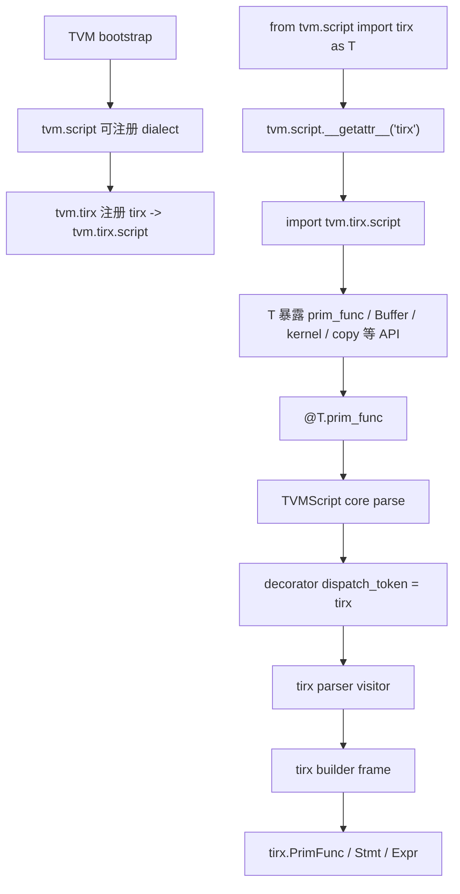
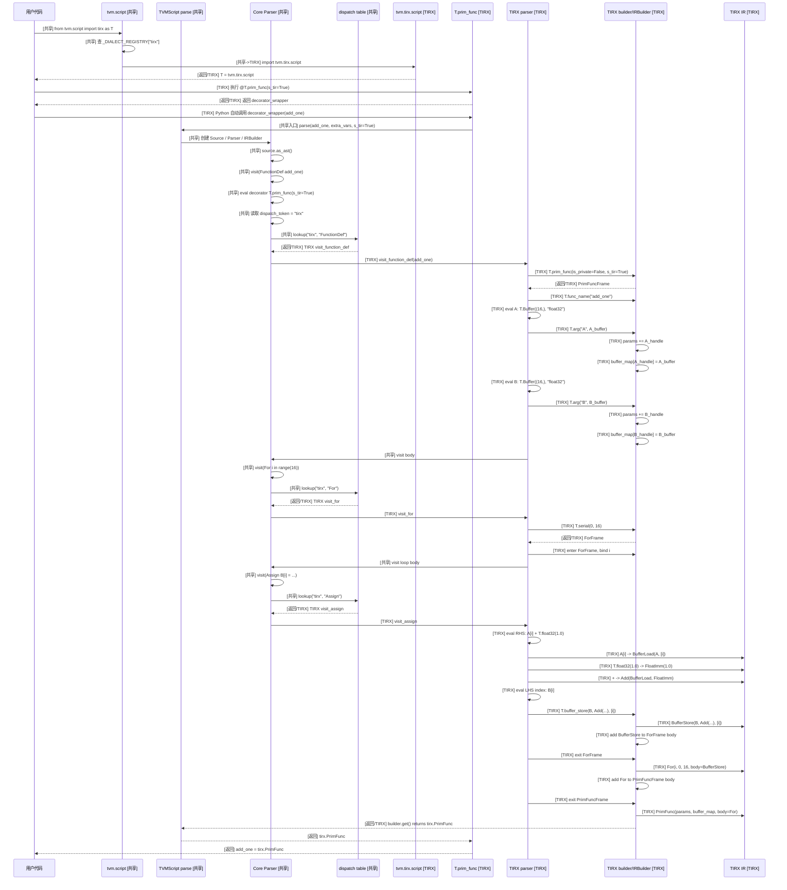
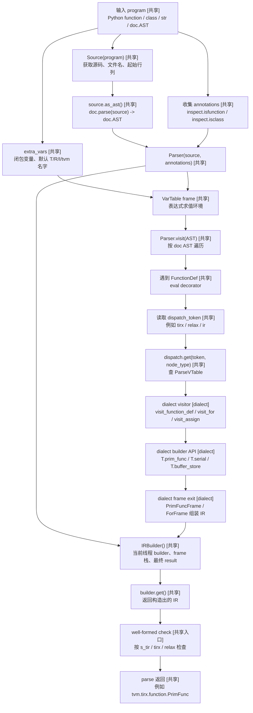
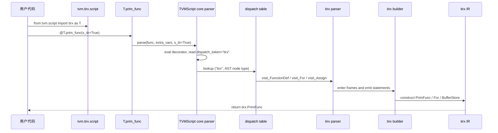
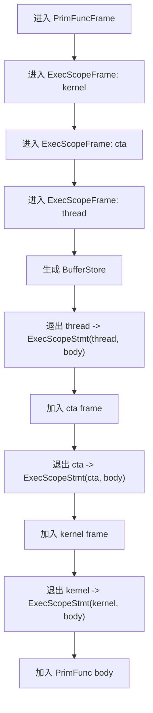
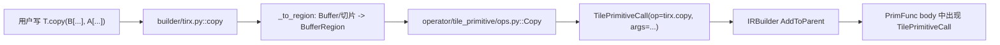
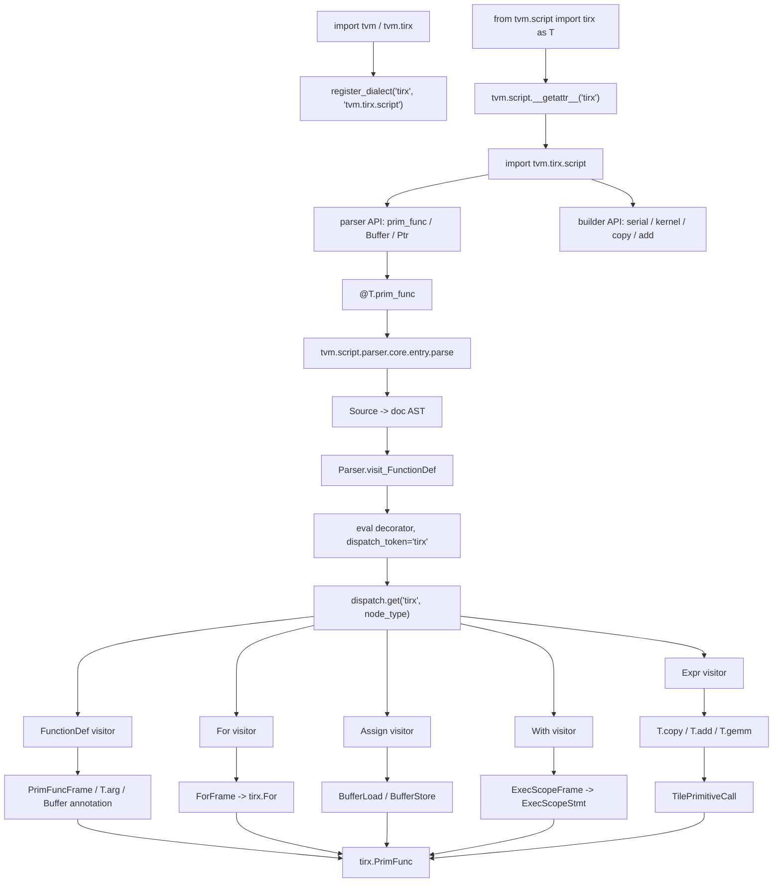

# TIRX 前端入门：从 TVMScript dialect 到 TIRX IR

这篇文档重新梳理 TIRX 的“前端”部分：用户写的 Python 风格
TVMScript DSL，如何通过 TVMScript dialect 机制进入 TIRX 自己的
parser / builder，最后被构造成 `tirx.PrimFunc`、`tirx.For`、
`tirx.BufferStore`、`tirx.ExecScopeStmt`、`tirx.TilePrimitiveCall`
这些 IR 节点。

本文只讨论前端边界：

```text
TIRX 前端
  Python 源码
    -> tvm.script dialect 解析
    -> TIRX parser dispatch
    -> IRBuilder frame
    -> tirx.PrimFunc / Stmt / Expr / TilePrimitiveCall

TIRX 后续阶段
  TilePrimitiveCall
    -> operator dispatch
    -> LowerTIRx
    -> target intrinsic / codegen
```

所以这篇不会展开调度、完整 lowering pipeline、CUDA/PTX codegen 和 runtime。

## 1. 先看全链路

用户一般这样写 TIRX/TensorIR 风格的函数：

```python
from tvm.script import tirx as T


@T.prim_func(s_tir=True)
def add_one(A: T.Buffer((16,), "float32"), B: T.Buffer((16,), "float32")) -> None:
    for i in range(16):
        B[i] = A[i] + T.float32(1.0)
```

这个 Python 函数体不是按普通 Python 函数执行。`@T.prim_func` 会触发
TVMScript parser：parser 拿到函数源码，转成 Python AST，再按 `tirx`
dialect 的规则把 AST 翻译成 TIRX IR。

整体链路可以先记成：



上面例子大致生成的 IR 结构是：

```text
tirx.PrimFunc
  params: [A_handle, B_handle]
  buffer_map:
    A_handle -> Buffer(shape=(16,), dtype=float32)
    B_handle -> Buffer(shape=(16,), dtype=float32)
  body:
    For(i, min=0, extent=16)
      BufferStore(
        buffer=B,
        indices=[i],
        value=BufferLoad(A, [i]) + FloatImm(1.0)
      )
```

关键点是：

```text
Python 语法只是前端表达形式
TVMScript parser 会把它解释成结构化 IR 节点树
```

### 1.1 `add_one` 的解析时序

以上面的 `add_one` 为例，前端解析的时序是：



### 1.2 TVMScript parse 架构图

`parse()` 的设计可以看成“共享 parser 框架 + dialect 插件规则”的组合。共享层
负责拿源码、建 AST、维护变量表、管理 IRBuilder 和做 dispatch；每个 dialect
只需要注册自己的 decorator、AST visitor 和 builder frame。



以 `add_one` 为例，这张图里对应关系是：

| 架构节点 | `add_one` 中的具体表现 |
| --- | --- |
| `program` | `@T.prim_func` 传进来的 Python function object。 |
| `Source(program)` | 从 `add_one` 函数对象找到源码文本。 |
| `extra_vars` | 包含用户代码里的 `T`，也就是 `tvm.tirx.script`。 |
| `dispatch_token` | `T.prim_func(s_tir=True)` 上的 token 是 `"tirx"`。 |
| `dialect visitor` | TIRX 的 `visit_function_def`、`visit_for`、`visit_assign`。 |
| `dialect builder` | `T.prim_func`、`T.arg`、`T.serial`、`T.buffer_store`。 |
| `builder.get()` | 返回 `tvm.tirx.function.PrimFunc`。 |

## 2. TVMScript dialect 设计

TIRX 前端不是硬编码在 `tvm.script` 里的一个静态属性，而是通过
TVMScript dialect 机制接入。这个机制解决的问题是：

```text
同一个 tvm.script 命名空间
  可以挂多个 IR 方言
  每个方言拥有自己的 parser / builder / printer
  中央 tvm.script 不需要 eager import 所有方言实现
```

TIRX 就是其中一个 dialect。

### 2.1 注册表：`_DIALECT_REGISTRY`

核心源码：

- `3rdparty/tvm/python/tvm/script/__init__.py`
- `3rdparty/tvm/python/tvm/tirx/__init__.py`
- `3rdparty/tvm/python/tvm/tirx/script/__init__.py`

`tvm.script` 里维护一个 registry：

```python
_DIALECT_REGISTRY: dict[str, str] = {}


def register_dialect(name: str, module_path: str) -> None:
    _DIALECT_REGISTRY[name] = module_path
```

TIRX 在自己的包初始化时注册：

```python
import tvm.script

tvm.script.register_dialect("tirx", "tvm.tirx.script")
```

含义是：

```text
短名 tirx
  -> 对应的 TVMScript 包是 tvm.tirx.script
```

所以 `tirx` dialect 的 parser、builder、动态 tile primitive API，都由
`tvm.tirx.script` 这一层负责提供。

### 2.2 `from tvm.script import tirx as T` 如何工作

用户写：

```python
from tvm.script import tirx as T
```

等价于向 `tvm.script` 模块取一个名为 `tirx` 的属性。`tvm.script` 本身没有
静态定义 `tirx`，于是触发模块级 `__getattr__`：

```python
def __getattr__(name: str):
    if name in _DIALECT_REGISTRY:
        module = importlib.import_module(_DIALECT_REGISTRY[name])
        globals()[name] = module
        return module
    ...
```

当 `name == "tirx"` 时：

```text
_DIALECT_REGISTRY["tirx"] == "tvm.tirx.script"
```

于是实际导入的是：

```python
import tvm.tirx.script
T = tvm.tirx.script
```

这也是为什么 `T` 不是一个普通 Python 类型集合，而是一组 DSL API：

```python
T.prim_func
T.Buffer
T.Ptr
T.serial
T.grid
T.kernel
T.cta
T.thread
T.copy
T.add
```

这些名字来自 `tvm.tirx.script` 对 parser 和 builder 的再导出。

### 2.3 子包重定向：`tvm.script.parser.tirx`

TVMScript 里还有一些历史或内部路径会写成：

```python
tvm.script.parser.tirx
tvm.script.ir_builder.tirx
from tvm.script.parser.tirx.entry import prim_func
```

但 TIRX 的真实实现路径已经在：

```text
tvm.tirx.script.parser
tvm.tirx.script.builder
```

因此 `tvm.script` 还做了子包重定向：

```python
_REDIRECTED_SUBPACKAGES = {
    "tvm.script.parser": "parser",
    "tvm.script.ir_builder": "builder",
}
```

解析规则可以理解成：

```text
tvm.script.parser.tirx
  -> _DIALECT_REGISTRY["tirx"] + ".parser"
  -> tvm.tirx.script.parser

tvm.script.ir_builder.tirx
  -> _DIALECT_REGISTRY["tirx"] + ".builder"
  -> tvm.tirx.script.builder
```

对于更深的 import，例如：

```python
from tvm.script.parser.tirx.entry import prim_func
```

单靠模块 `__getattr__` 不够，因为 Python import machinery 不会逐层触发普通
属性访问。源码里用 `_DialectRedirectFinder` 挂到 `sys.meta_path`，把这类深层
路径别名到真实模块：

```text
tvm.script.parser.tirx.entry
  -> tvm.tirx.script.parser.entry
```

这层设计让旧路径和新路径都能工作，也让新增 dialect 不需要改 `tvm.script`
的静态 import 列表。

### 2.4 dialect 包需要暴露什么

`tvm.tirx.script.__init__` 是 TIRX dialect 的 public script 入口。它大致做三件事：

```python
from .parser import *
from .parser import Buffer, Ptr, prim_func
from .builder.ir import TensorMap, meta_class
from .builder.tirx import *
```

可以按职责拆开看：

| 层 | 真实路径 | 作用 |
| --- | --- | --- |
| dialect 注册 | `tvm/tirx/__init__.py` | 注册 `"tirx" -> "tvm.tirx.script"`。 |
| dialect public API | `tvm/tirx/script/__init__.py` | 暴露 `T.prim_func`、`T.Buffer`、`T.kernel`、`T.copy` 等用户 API。 |
| parser entry | `tvm/tirx/script/parser/entry.py` | 实现 `@T.prim_func`、`T.inline`、`T.macro`、`Buffer`/`Ptr` proxy。 |
| parser visitor | `tvm/tirx/script/parser/parser.py` | 注册 `token="tirx"` 的 AST visitor。 |
| builder Python API | `tvm/tirx/script/builder/ir.py` | 提供 loop、buffer、exec scope、dtype、intrinsic 等 builder 名字。 |
| tile primitive API | `tvm/tirx/script/builder/tirx.py` | 提供 `T.copy`、`T.add`、`T.gemm` 等 tile primitive 前端。 |
| builder C++ 实现 | `src/tirx/script/builder/*.cc` | frame 出栈时真正组装 TIRX IR 节点。 |

注意：dialect 解析和 parser dispatch 是两层不同的机制。

```text
dialect 解析
  解决 T 这个模块从哪里来

parser dispatch
  解决同一个 Python AST 应该按哪套 IR 规则访问
```

`from tvm.script import tirx as T` 只解决第一件事。真正让 AST 走 TIRX 规则的是
`dispatch_token="tirx"`。

## 3. `@T.prim_func` 如何选择 TIRX parser

`@T.prim_func` 的入口在：

```text
3rdparty/tvm/python/tvm/tirx/script/parser/entry.py
```

简化后是：

```python
def prim_func(func=None, private=False, check_well_formed=True, s_tir=False, persistent=False):
    def decorator_wrapper(func):
        extra_vars = inspect_function_capture(func)
        f = parse(func, extra_vars, check_well_formed=check_well_formed, s_tir=s_tir)
        return f

    if func is not None:
        return decorator_wrapper(func)
    else:
        setattr(decorator_wrapper, "dispatch_token", "tirx")
        return decorator_wrapper


setattr(prim_func, "dispatch_token", "tirx")
```

这里容易误解的一点是：`parse(...)` 本身没有传一个显式
`dispatch_token="tirx"` 参数。token 是挂在 decorator 对象上的。

TVMScript core parser 访问 `FunctionDef` 时会：

1. 读取函数 AST 上最后一个 decorator。
2. 对 decorator 表达式求值，例如 `T.prim_func(s_tir=True)`。
3. 从求值结果上读取 `decorator.dispatch_token`。
4. 用这个 token 查 dispatch table。

核心代码关系：

```text
Parser.visit_FunctionDef
  -> get_dispatch_token(node)
       -> eval_expr(node.decorator_list[-1])
       -> decorator.dispatch_token == "tirx"
  -> dispatch.get(token="tirx", type_name="FunctionDef")
  -> tirx parser 的 visit_function_def
```

所以 TIRX parser 的接入方式是：

```python
@dispatch.register(token="tirx", type_name="FunctionDef")
def visit_function_def(self, node):
    ...

@dispatch.register(token="tirx", type_name="For")
def visit_for(self, node):
    ...

@dispatch.register(token="tirx", type_name="Assign")
def visit_assign(self, node):
    ...
```

同一棵 AST，如果 dispatch token 变成 Relax 或别的 dialect，就会走另一套 visitor。

调用时序可以这样看：



## 4. AST 如何变成 TIRX IR

TIRX parser 的主要规则在：

```text
3rdparty/tvm/python/tvm/tirx/script/parser/parser.py
```

核心模式是：

```text
Python AST node
  -> dispatch(token="tirx", type_name=node_type)
  -> TIRX visitor
  -> builder API
  -> IRBuilder frame
  -> TIRX IR node
```

### 4.1 `FunctionDef` -> `tirx.PrimFunc`

对于：

```python
@T.prim_func(s_tir=True)
def add_one(A: T.Buffer((16,), "float32"), B: T.Buffer((16,), "float32")) -> None:
    ...
```

`visit_function_def` 会做几件事：

1. 从 decorator 里读取 `private`、`s_tir`、`persistent`。
2. 创建 `T.prim_func(...)` builder frame。
3. 用 `T.func_name(node.name)` 设置函数名。
4. 解析返回类型。
5. 解析参数注解。
6. 用 `T.arg(arg_name, annotation)` 创建参数。
7. 访问函数体。
8. frame 退出时组装 `tirx.PrimFunc`。

可以理解为：

```text
def add_one(A: T.Buffer(...), B: T.Buffer(...)):
    body

变成：

PrimFunc(
  params=[A_handle, B_handle],
  buffer_map={
    A_handle: A_buffer,
    B_handle: B_buffer,
  },
  body=<由函数体生成的 Stmt 树>,
  attrs={..., "s_tir": True}
)
```

### 4.2 参数注解 -> `Buffer` 和 `buffer_map`

参数里的：

```python
A: T.Buffer((16,), "float32")
```

不是 Python 类型检查用的普通注解。parser 会对这个注解求值，得到一个 TIRX
`Buffer` 描述。函数参数底层仍然是 handle/ptr 形式，`buffer_map` 把 handle
和结构化 buffer 信息连起来。

新手可以这样记：

```text
函数参数名 A
  在用户 DSL 里像 Buffer 一样使用
  在 IR 里由参数 Var + buffer_map 共同表达
```

### 4.3 `for` -> `tirx.For`

例子：

```python
for i in range(16):
    B[i] = A[i] + T.float32(1.0)
```

TIRX parser 会在 AST 层特殊处理 `range(...)`。它不是创建 Python 迭代器，
而是转换成 `T.serial(...)` builder frame：

```text
range(16)       -> T.serial(0, 16)
range(4, 16)    -> T.serial(4, 16)
range(0, 16, 2) -> T.serial(0, 16, step=2)
```

frame 退出后生成：

```text
For(
  loop_var=i,
  min=0,
  extent=16,
  kind=serial,
  body=...
)
```

如果用户写：

```python
for i, j in T.grid(16, 16):
    C[i, j] = A[i, j] + B[i, j]
```

`T.grid(16, 16)` 会求值成多层 loop frame，最后得到嵌套 `For`：

```text
For(i, 0, 16)
  For(j, 0, 16)
    BufferStore(C, BufferLoad(A, [i, j]) + BufferLoad(B, [i, j]), [i, j])
```

### 4.4 `A[i]` -> `BufferLoad`

表达式里的 buffer 下标访问：

```python
A[i]
```

在 IR 里是表达式节点：

```text
BufferLoad(buffer=A, indices=[i])
```

`BufferLoad` 是表达式，因为它产生一个值，可以继续参与计算：

```python
A[i] + T.float32(1.0)
```

对应：

```text
Add(
  BufferLoad(A, [i]),
  FloatImm(1.0)
)
```

### 4.5 `B[i] = ...` -> `BufferStore`

赋值语句：

```python
B[i] = A[i] + T.float32(1.0)
```

parser 识别左边是 `Subscript`，于是调用：

```text
T.buffer_store(buffer=B, value=<rhs>, indices=[i])
```

最终生成：

```text
BufferStore(
  buffer=B,
  value=Add(BufferLoad(A, [i]), FloatImm(1.0)),
  indices=[i]
)
```

这里的区分很重要：

| 语法 | IR 节点 | 原因 |
| --- | --- | --- |
| `A[i]` | `BufferLoad` | 读 buffer，产生值，所以是 `PrimExpr`。 |
| `B[i] = v` | `BufferStore` | 写 buffer，有副作用，所以是 `Stmt`。 |

### 4.6 `if` / `while` / `return`

TIRX parser 也处理常见控制流：

```python
if i < 8:
    B[i] = A[i]
else:
    B[i] = T.float32(0)
```

生成：

```text
IfThenElse(
  condition=i < 8,
  then_case=BufferStore(...),
  else_case=BufferStore(...)
)
```

`while` 会生成 `tirx.While`，`return expr` 会被转成带返回语义的：

```text
Evaluate(tirx.ret(expr))
```

## 5. IRBuilder frame：为什么 `with` 能生成嵌套 IR

TIRX 前端不是每解析一句就直接返回完整 IR，而是靠 IRBuilder 的 frame 栈累积语句。

frame 可以理解成“正在构造的作用域”：

```text
进入一个 frame
  后续语句先加入这个 frame

退出这个 frame
  frame 把收集到的语句包成一个 IR 节点
  再把这个节点加入父 frame
```

例如：

```python
with T.kernel():
    with T.cta():
        with T.thread():
            B[0] = A[0]
```

大致构造过程：



最终 IR 结构类似：

```text
PrimFunc
  ExecScopeStmt(kernel)
    ExecScopeStmt(cta)
      ExecScopeStmt(thread)
        BufferStore(B, BufferLoad(A, [0]), [0])
```

相关入口：

```text
3rdparty/tvm/python/tvm/tirx/script/builder/frame.py
3rdparty/tvm/python/tvm/tirx/script/builder/ir.py
3rdparty/tvm/src/tirx/script/builder/ir.cc
3rdparty/tvm/src/tirx/script/builder/frame.cc
```

C++ builder 里能看到类似：

```cpp
ExecScopeFrame Kernel(...) { return ExecScopeBlock("kernel", guards); }
ExecScopeFrame CTA(...)    { return ExecScopeBlock("cta", guards); }
ExecScopeFrame Thread(...) { return ExecScopeBlock("thread", guards); }
```

frame 出栈时会把 body 包成：

```cpp
tvm::tirx::ExecScopeStmt(exec_scope, body)
```

这就是 `with T.kernel()`、`with T.cta()`、`with T.thread()` 这种写法的本质：

```text
Python with 语法
  -> builder frame 作用域
  -> ExecScopeStmt 嵌套 IR
```

## 6. Tile Primitive 前端：`T.copy` 只生成调用节点

TIRX 除了普通 loop/load/store，还提供 tile primitive API。它们是更高层的
kernel building block，例如 copy、add、gemm、reduction。

例子：

```python
from tvm.script import tirx as T


@T.prim_func
def copy_tile(A: T.Buffer((128,), "float32"), B: T.Buffer((128,), "float32")):
    with T.kernel():
        T.copy(B[0:128], A[0:128])
```

这里的 `T.copy(...)` 在前端阶段不会立刻展开成 CUDA load/store。它只生成一个
`tirx.TilePrimitiveCall`：

```text
TilePrimitiveCall(
  op=tirx.copy,
  args=[
    BufferRegion(B, region=[0:128]),
    BufferRegion(A, region=[0:128])
  ],
  workspace={},
  config={},
  dispatch=None
)
```

对应 Python builder 在：

```text
3rdparty/tvm/python/tvm/tirx/script/builder/tirx.py
```

简化逻辑是：

```python
def copy(dst, src, workspace=None, dispatch=None, **kwargs):
    dst = _to_region(dst)
    src = _to_region(src)
    return f_insert(
        tirx_op.Copy(dst, src, workspace=workspace, config=config, dispatch=dispatch)
    )
```

这里的 `tirx_op.Copy` 来自：

```text
3rdparty/tvm/python/tvm/tirx/operator/tile_primitive/ops.py
```

它是 `TilePrimitiveCall` 的 typed wrapper：

```python
class Copy(TilePrimitiveCall):
    op = get_tirx_op("copy")
    dst = ArgProperty(0)
    src = ArgProperty(1)
```

完整链路是：



再看 `T.add`：

```python
@T.prim_func
def add_tile(
    A: T.Buffer((128,), "float32"),
    B: T.Buffer((128,), "float32"),
    C: T.Buffer((128,), "float32"),
):
    with T.kernel():
        T.add(C[0:128], A[0:128], B[0:128])
```

前端结果不是 128 次标量加法，而是：

```text
TilePrimitiveCall(
  op=tirx.add,
  args=[C_region, A_region, B_region]
)
```

真正选择“用 scalar copy、vectorized copy、collective copy、TMA、tcgen05
还是别的实现”，是在后续 operator dispatch / lowering 阶段完成的。

## 7. 动态 tile primitive：为什么有些 `T.xxx` 源码里找不到

`tvm.tirx.script.__init__` 里还有一个 `__getattr__`：

```python
def __getattr__(name: str):
    op_name = "tirx." + name
    ...
    return _fn
```

它的作用是：如果用户写了一个没有显式定义的 `T.some_op(...)`，前端可以懒注册
一个 `tirx.some_op`，并生成通用的 `TilePrimitiveCall`。

例如：

```python
T.my_custom_op(dst, src, config={"x": 1})
```

可以变成：

```text
TilePrimitiveCall(op=tirx.my_custom_op, args=[...], config={"x": 1})
```

这只解决“前端能表达”。后续如果没有对应 dispatch 实现，lowering 阶段仍然会失败。

这里有两层 `__getattr__`，不要混在一起：

| 位置 | 作用 |
| --- | --- |
| `tvm.script.__getattr__` | 把 `tvm.script.tirx` 解析成 `tvm.tirx.script`。 |
| `tvm.tirx.script.__getattr__` | 把未知 `T.xxx` 解析成动态 tile primitive 调用。 |

## 8. 前端产物和后续阶段的边界

到这里，TIRX 前端已经完成核心任务：

```text
用户 DSL
  -> tirx.PrimFunc
       body 中包含 For / BufferStore / ExecScopeStmt / TilePrimitiveCall
```

前端会做：

| 输入语法 | 前端产物 |
| --- | --- |
| `@T.prim_func` | `tirx.PrimFunc` |
| `A: T.Buffer(...)` | 参数 `Var` + `buffer_map` |
| `for i in range(n)` | `tirx.For` |
| `A[i]` | `tirx.BufferLoad` |
| `B[i] = v` | `tirx.BufferStore` |
| `with T.kernel()` | `tirx.ExecScopeStmt(kind=kernel)` |
| `T.copy(...)` / `T.gemm(...)` | `tirx.TilePrimitiveCall` |

前端不会做：

| 不在前端做的事 | 后续阶段 |
| --- | --- |
| 选择 tile primitive 的具体实现 | `TilePrimitiveDispatch` / operator dispatcher |
| 展开 TIRX exec scope | `LowerTIRx` |
| 做 target-specific intrinsic lowering | target lowering / codegen |
| 生成 CUDA/PTX 或 host packed API | build pipeline / codegen / runtime |

相关后续入口包括：

- `3rdparty/tvm/python/tvm/tirx/transform/transform.py`
- `3rdparty/tvm/src/tirx/transform/lower_tirx.cc`
- `3rdparty/tvm/src/tirx/transform/tile_primitive_dispatch.cc`
- `3rdparty/tvm/python/tvm/tirx/operator/tile_primitive/dispatcher.py`

本文只需要记住：

```text
T.copy / T.add / T.gemm 在前端阶段不是具体实现
它们先被表达成 TilePrimitiveCall
后续 pass 再把 TilePrimitiveCall 展开成目标相关实现
```

## 9. 一张更完整的总图



## 10. 推荐阅读顺序

如果按源码继续读，建议按这个顺序：

1. `3rdparty/tvm/python/tvm/script/__init__.py`
   看 `_DIALECT_REGISTRY`、`register_dialect`、`__getattr__`、
   `_DialectRedirectFinder`。

2. `3rdparty/tvm/python/tvm/script/parser/core/parser.py`
   看 `get_dispatch_token`、`with_dispatch_token`、`visit_FunctionDef`、
   `visit` 如何按 token + AST type 分发。

3. `3rdparty/tvm/python/tvm/tirx/__init__.py`
   看 TIRX dialect 注册和 `tvm.tirx` 对外导出的 IR/API。

4. `3rdparty/tvm/python/tvm/tirx/script/__init__.py`
   看 `tvm.script.tirx` 暴露了哪些 parser / builder API，以及动态
   `TilePrimitiveCall` 的 `__getattr__`。

5. `3rdparty/tvm/python/tvm/tirx/script/parser/entry.py`
   看 `@T.prim_func` 如何捕获函数、闭包变量，并调用 TVMScript core
   `parse(...)`。

6. `3rdparty/tvm/python/tvm/tirx/script/parser/parser.py`
   看 `FunctionDef`、`For`、`Assign`、`With`、`Expr` 等 AST 节点如何变成 IR。

7. `3rdparty/tvm/python/tvm/tirx/script/builder/ir.py`
   看 Python 侧 builder API 名字。很多具体构造会通过 FFI 进入 C++ builder。

8. `3rdparty/tvm/src/tirx/script/builder/ir.cc`
   看 C++ IRBuilder frame 如何在退出 scope 时组装 `For`、`ExecScopeStmt`、
   `BufferStore` 等节点。

9. `3rdparty/tvm/python/tvm/tirx/script/builder/tirx.py`
   看 `T.copy`、`T.add`、`T.gemm` 这类 tile primitive API 如何插入
   `TilePrimitiveCall`。

10. `3rdparty/tvm/python/tvm/tirx/operator/tile_primitive/ops.py`
    看 `Copy`、`Add`、`Gemm` 等 typed wrapper 如何定义 op 和参数访问器。

读完这些，你应该能回答四个前端核心问题：

```text
1. from tvm.script import tirx as T 为什么能定位到 tvm.tirx.script？
2. @T.prim_func 为什么返回的是 tirx.PrimFunc，而不是 Python 函数？
3. for / if / buffer 读写为什么会变成 IR 节点？
4. T.copy / T.gemm 为什么只是 TilePrimitiveCall，而不是马上生成 CUDA 代码？
```
