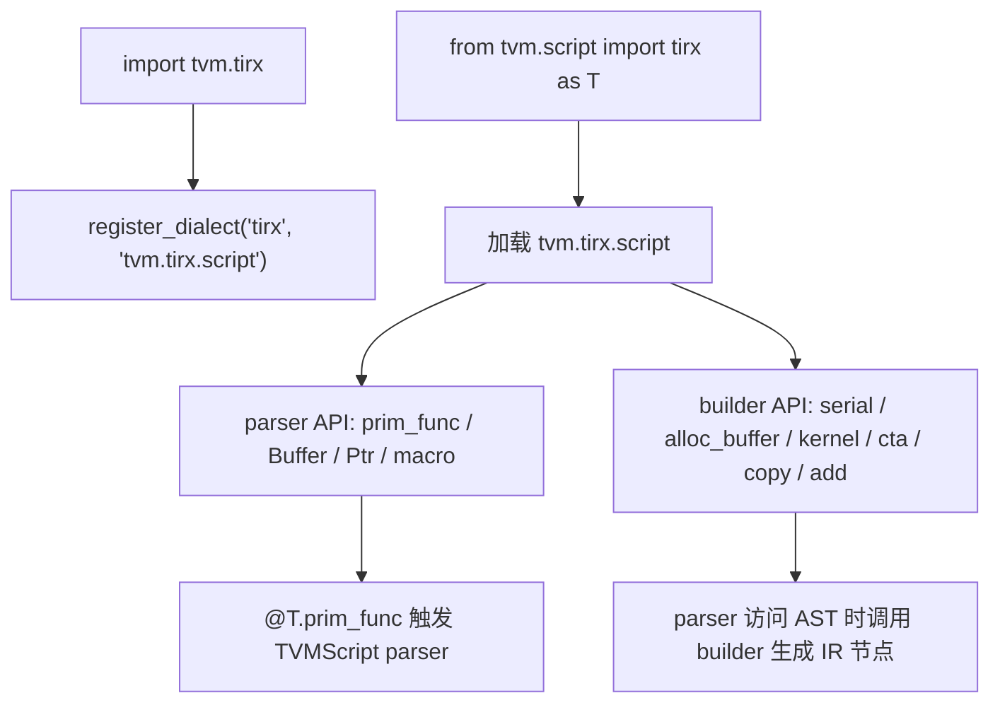
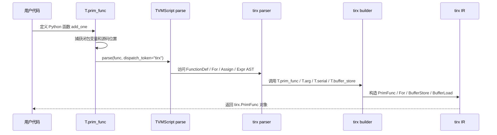
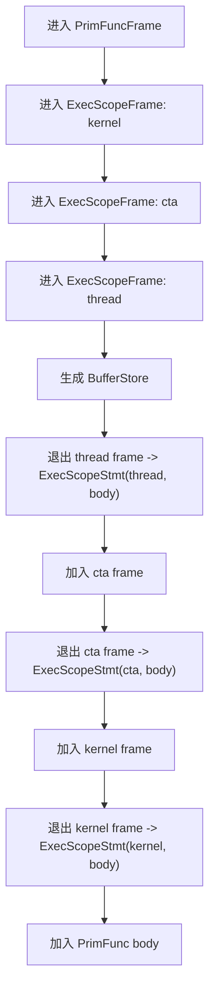
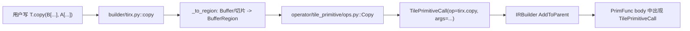
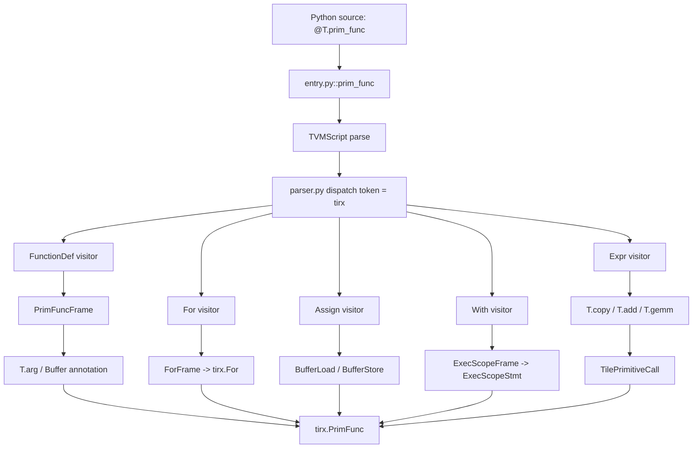

# TIRX 前端入门：从 `@T.prim_func` 到 `TilePrimitiveCall`

这篇文档只讲 TIRX 的“前端”部分：用户写的 Python 风格
TVMScript DSL，如何被解析成 `tirx.PrimFunc`、`tirx.For`、
`tirx.BufferStore`、`tirx.ExecScopeStmt`、`tirx.TilePrimitiveCall`
这些 IR 节点。

本文先不展开调度实现、lowering、CUDA/PTX codegen。你可以先把边界记成：

```text
TIRX 前端
  用户 Python 源码
    -> TVMScript parser
    -> IRBuilder frame
    -> tirx.PrimFunc / Stmt / Expr / TilePrimitiveCall

TIRX 后续阶段
  TilePrimitiveCall
    -> operator dispatch
    -> LowerTIRx
    -> target intrinsic / codegen
```

## 1. 先看一个最小例子

用户一般这样写 TIRX/TensorIR 风格的函数：

```python
from tvm.script import tirx as T


@T.prim_func(s_tir=True)
def add_one(A: T.Buffer((16,), "float32"), B: T.Buffer((16,), "float32")) -> None:
    for i in range(16):
        B[i] = A[i] + T.float32(1.0)
```

新手最容易误解的一点是：这个 Python 函数体不是普通 Python 函数那样执行。
`@T.prim_func` 装饰器会拿到函数源码，把源码转成 Python AST，然后由
TVMScript parser 访问 AST，把每一类语法翻译成 TIRX IR。

上面的代码大致会生成这样的 IR 结构：

```text
tirx.PrimFunc
  params: [A_handle, B_handle]
  buffer_map:
    A_handle -> Buffer(shape=(16,), dtype=float32)
    B_handle -> Buffer(shape=(16,), dtype=float32)
  body:
    For(i, min=0, extent=16)
      BufferStore(
        buffer=B,
        indices=[i],
        value=BufferLoad(A, [i]) + FloatImm(1.0)
      )
```

所以，TIRX 前端做的事情可以理解为：

```text
Python 语法长得像程序
但 parser 把它解释成 IR 节点树
```

## 2. 入口：`from tvm.script import tirx as T`

TIRX 前端入口不是一个单独命令，而是 TVMScript dialect 机制。

关键源码：

- `3rdparty/tvm/python/tvm/tirx/__init__.py`
- `3rdparty/tvm/python/tvm/tirx/script/__init__.py`
- `3rdparty/tvm/python/tvm/tirx/script/parser/entry.py`
- `3rdparty/tvm/python/tvm/tirx/script/parser/parser.py`
- `3rdparty/tvm/python/tvm/tirx/script/builder/ir.py`
- `3rdparty/tvm/python/tvm/tirx/script/builder/tirx.py`

`tvm.tirx.__init__` 里注册了 dialect：

```python
tvm.script.register_dialect("tirx", "tvm.tirx.script")
```

因此用户写：

```python
from tvm.script import tirx as T
```

拿到的不是普通 Python 模块别名那么简单，而是 TVMScript 为 `tirx`
dialect 准备好的一组 parser 和 builder API。`tvm.tirx.script.__init__`
会把这些接口暴露出来：

```python
from .parser import *
from .parser import Buffer, Ptr, prim_func
from .builder.tirx import *
```

也就是说，`T.prim_func`、`T.Buffer`、`T.serial`、`T.kernel`、
`T.copy` 这些名字都来自 TIRX script 层。

整体入口关系如下：



## 3. `@T.prim_func` 到底做了什么

`@T.prim_func` 的实现入口在：

```text
3rdparty/tvm/python/tvm/tirx/script/parser/entry.py
```

核心逻辑可以简化成：

```python
def prim_func(func=None, private=False, check_well_formed=True, s_tir=False, persistent=False):
    def decorator_wrapper(func):
        extra_vars = inspect_function_capture(func)
        f = parse(func, extra_vars, check_well_formed=check_well_formed, s_tir=s_tir)
        return f

    return decorator_wrapper(func) if func is not None else decorator_wrapper
```

这里有几个关键点：

| 概念 | 作用 |
| --- | --- |
| `inspect_function_capture` | 找出 Python 函数闭包里引用的变量，供 parser 求值。 |
| `parse(...)` | 进入 TVMScript parser，把 Python AST 翻译成 IR。 |
| `dispatch_token="tirx"` | 告诉通用 parser：访问 AST 时使用 TIRX 这套规则。 |
| `s_tir=True` | 给构造出的 `PrimFunc` 标记 S-TIR/TensorIR 风格，方便后续 schedule/lowering。 |

调用时序可以这样看：



## 4. AST 如何变成 IR

TIRX parser 的主要规则在：

```text
3rdparty/tvm/python/tvm/tirx/script/parser/parser.py
```

它通过类似下面的注册方式，把不同 AST 节点交给不同处理函数：

```python
@dispatch.register(token="tirx", type_name="For")
def visit_for(self, node):
    ...

@dispatch.register(token="tirx", type_name="Assign")
def visit_assign(self, node):
    ...

@dispatch.register(token="tirx", type_name="FunctionDef")
def visit_function_def(self, node):
    ...
```

### 4.1 `FunctionDef` -> `tirx.PrimFunc`

再看这个函数头：

```python
@T.prim_func(s_tir=True)
def add_one(A: T.Buffer((16,), "float32"), B: T.Buffer((16,), "float32")) -> None:
    ...
```

parser 访问 `FunctionDef` 时会做几件事：

1. 读取装饰器参数，比如 `private`、`s_tir`、`persistent`。
2. 创建 `T.prim_func(...)` builder frame。
3. 设置函数名。
4. 解析参数注解 `T.Buffer((16,), "float32")`。
5. 用 `T.arg(arg_name, annotation)` 创建参数。
6. 访问函数体，生成 body。
7. frame 退出时组装出 `tirx.PrimFunc`。

可以把它想成：

```text
def add_one(A: T.Buffer(...), B: T.Buffer(...)):
    body

变成：

PrimFunc(
  params=[A_handle, B_handle],
  buffer_map={A_handle: A_buffer, B_handle: B_buffer},
  body=<由函数体生成的 Stmt 树>,
  attrs={... s_tir ...}
)
```

### 4.2 参数注解 -> `Buffer` 和 `buffer_map`

参数里的 `T.Buffer((16,), "float32")` 不是 Python 类型检查用的普通注解。
parser 会对这个注解求值，得到 TIRX 的 `Buffer` 对象。

```python
A: T.Buffer((16,), "float32")
```

含义是：

```text
A 是函数参数
A 对应一个 shape=(16,), dtype=float32 的 Buffer
函数真实形参底层仍然是 handle/ptr 形式
buffer_map 记录 handle -> Buffer 的结构化信息
```

新手可以记住：

```text
函数参数名 A
  在用户代码里像 Buffer 一样使用
  在 IR 里由参数 Var + buffer_map 共同表达
```

### 4.3 `for` -> `tirx.For`

例子：

```python
for i in range(16):
    B[i] = A[i] + T.float32(1.0)
```

TIRX parser 对 `range(...)` 做了特殊处理。它不是创建 Python 迭代器，而是转换成
`T.serial(...)` builder frame，最后生成 `tirx.For`。

简化后的规则：

```text
range(16)      -> T.serial(0, 16)
range(4, 16)   -> T.serial(4, 16)
range(0, 16, 2)-> T.serial(0, 16, step=2)
```

生成的 IR 形态：

```text
For(
  loop_var=i,
  min=0,
  extent=16,
  kind=serial,
  body=...
)
```

如果用户写的是：

```python
for i, j in T.grid(16, 16):
    C[i, j] = A[i, j] + B[i, j]
```

parser 会把 `T.grid(16, 16)` 求值成多层 loop frame，最后得到嵌套 `For`：

```text
For(i, 0, 16)
  For(j, 0, 16)
    BufferStore(C, BufferLoad(A, [i, j]) + BufferLoad(B, [i, j]), [i, j])
```

### 4.4 `A[i]` -> `BufferLoad`

表达式里的 buffer 下标访问：

```python
A[i]
```

在 IR 里是一个表达式节点：

```text
BufferLoad(buffer=A, indices=[i])
```

为什么 `BufferLoad` 是表达式？因为它产生一个值，可以参与加减乘除：

```python
A[i] + T.float32(1.0)
```

对应：

```text
Add(
  BufferLoad(A, [i]),
  FloatImm(1.0)
)
```

### 4.5 `B[i] = ...` -> `BufferStore`

赋值语句：

```python
B[i] = A[i] + T.float32(1.0)
```

parser 会识别左边是 `Subscript`，于是调用：

```text
T.buffer_store(buffer=B, value=<rhs>, indices=[i])
```

最终生成：

```text
BufferStore(
  buffer=B,
  value=Add(BufferLoad(A, [i]), FloatImm(1.0)),
  indices=[i]
)
```

这里也有一个重要区分：

| 语法 | IR 节点 | 为什么 |
| --- | --- | --- |
| `A[i]` | `BufferLoad` | 读 buffer，产生值，所以是 `PrimExpr`。 |
| `B[i] = v` | `BufferStore` | 写 buffer，有副作用，所以是 `Stmt`。 |

### 4.6 `if` / `while` / `return`

TIRX parser 还处理常见控制流：

```python
if i < 8:
    B[i] = A[i]
else:
    B[i] = T.float32(0)
```

生成：

```text
IfThenElse(
  condition=i < 8,
  then_case=BufferStore(...),
  else_case=BufferStore(...)
)
```

`while` 会生成 `tirx.While`，`return expr` 会被转成一个带返回语义的
`Evaluate(tirx.ret(expr))`。

## 5. IRBuilder frame：为什么 `with` 能生成嵌套 IR

TIRX 前端不是每解析一句就直接返回一个完整 IR，而是靠 IRBuilder 的 frame 栈累积语句。

你可以把 frame 理解成“正在构造的作用域”：

```text
进入一个 frame:
  后续语句先放到这个 frame 里

退出这个 frame:
  frame 把收集到的语句包成一个 IR 节点
  再把这个节点加入父 frame
```

例如：

```python
with T.kernel():
    with T.cta():
        with T.thread():
            B[0] = A[0]
```

大致构造过程：



最终 IR 结构类似：

```text
PrimFunc
  ExecScopeStmt(kernel)
    ExecScopeStmt(cta)
      ExecScopeStmt(thread)
        BufferStore(B, BufferLoad(A, [0]), [0])
```

相关 C++ builder 入口在：

```text
3rdparty/tvm/src/tirx/script/builder/ir.cc
```

里面可以看到：

```cpp
ExecScopeFrame Kernel(...) { return ExecScopeBlock("kernel", guards); }
ExecScopeFrame CTA(...)    { return ExecScopeBlock("cta", guards); }
ExecScopeFrame Thread(...) { return ExecScopeBlock("thread", guards); }
```

以及 frame 退出时会把 body 包成：

```cpp
tvm::tirx::ExecScopeStmt(exec_scope, body)
```

这就是 `with T.kernel()`、`with T.cta()` 这种写法的本质。

## 6. Tile Primitive 前端：`T.copy` 只生成调用节点

TIRX 除了普通 loop/load/store，还提供 tile primitive API。它们是更高层的
kernel building block，例如 copy、add、gemm、reduction。

先看一个简化例子：

```python
from tvm.script import tirx as T


@T.prim_func
def copy_tile(A: T.Buffer((128,), "float32"), B: T.Buffer((128,), "float32")):
    with T.kernel():
        T.copy(B[0:128], A[0:128])
```

这里的 `T.copy(...)` 在前端阶段不会立刻展开成 CUDA load/store。
它只生成一个 `tirx.TilePrimitiveCall`：

```text
TilePrimitiveCall(
  op=tirx.copy,
  args=[
    BufferRegion(B, region=[0:128]),
    BufferRegion(A, region=[0:128])
  ],
  workspace={},
  config={},
  dispatch=None
)
```

对应 Python builder 在：

```text
3rdparty/tvm/python/tvm/tirx/script/builder/tirx.py
```

简化逻辑是：

```python
def copy(dst, src, workspace=None, dispatch=None, **kwargs):
    dst = _to_region(dst)
    src = _to_region(src)
    return f_insert(
        tirx_op.Copy(dst, src, workspace=workspace, config=config, dispatch=dispatch)
    )
```

这里的 `tirx_op.Copy` 来自：

```text
3rdparty/tvm/python/tvm/tirx/operator/tile_primitive/ops.py
```

它是 `TilePrimitiveCall` 的一个 typed wrapper：

```python
class Copy(TilePrimitiveCall):
    op = get_tirx_op("copy")
    dst = ArgProperty(0)
    src = ArgProperty(1)
```

所以完整链路是：



再看 `T.add`：

```python
@T.prim_func
def add_tile(
    A: T.Buffer((128,), "float32"),
    B: T.Buffer((128,), "float32"),
    C: T.Buffer((128,), "float32"),
):
    with T.kernel():
        T.add(C[0:128], A[0:128], B[0:128])
```

前端结果不是 128 次标量加法，而是：

```text
TilePrimitiveCall(
  op=tirx.add,
  args=[C_region, A_region, B_region]
)
```

真正选择“用 scalar copy、vectorized copy、collective copy、TMA、tcgen05
还是别的实现”，是在后续 operator dispatch/lowering 阶段完成的。

## 7. 动态 tile primitive：为什么有些 `T.xxx` 源码里找不到

`tvm.tirx.script.__init__` 里还有一个 `__getattr__`：

```python
def __getattr__(name: str):
    ...
    op_name = "tirx." + name
    ...
    return _fn
```

它的作用是：如果用户写了一个没有显式定义的 `T.some_op(...)`，
前端可以懒注册一个 `tirx.some_op`，并生成通用的 `TilePrimitiveCall`。

这让 TIRX 的 tile primitive 前端更开放：

```python
T.my_custom_op(dst, src, config={"x": 1})
```

也可以变成：

```text
TilePrimitiveCall(op=tirx.my_custom_op, args=[...], config={"x": 1})
```

但这只解决“前端能表达”。后续如果没有 dispatch 实现，lowering 阶段仍然会失败。

## 8. 前端产物和后续阶段的边界

到这里，TIRX 前端已经完成了自己的核心任务：

```text
用户 DSL
  -> tirx.PrimFunc
       body 中包含 For / BufferStore / ExecScopeStmt / TilePrimitiveCall
```

后面才进入 TIRX lowering：

```text
TilePrimitiveCall
  -> TilePrimitiveDispatch
  -> Python operator implementation
  -> 返回更低层 PrimFunc
  -> LowerTIRx cleanup
  -> target codegen
```

相关入口包括：

- `3rdparty/tvm/python/tvm/tirx/transform/transform.py`
- `3rdparty/tvm/src/tirx/transform/lower_tirx.cc`
- `3rdparty/tvm/src/tirx/transform/tile_primitive_dispatch.cc`
- `3rdparty/tvm/python/tvm/tirx/operator/tile_primitive/dispatcher.py`

但这些已经超出本文的“前端”边界。本文只需要你记住：

```text
T.copy / T.add / T.gemm 在前端阶段不是具体实现
它们先被表达成 TilePrimitiveCall
后续 pass 再把 TilePrimitiveCall 展开成目标相关实现
```

## 9. 一张总图



## 10. 推荐阅读顺序

如果你想按源码继续读，建议按这个顺序：

1. `3rdparty/tvm/python/tvm/tirx/__init__.py`
   看 dialect 注册和 `tvm.tirx` 对外导出的 IR/API。

2. `3rdparty/tvm/python/tvm/tirx/script/__init__.py`
   看 `tvm.script.tirx` 暴露了哪些 parser/builder API，以及动态
   `TilePrimitiveCall` 的 `__getattr__`。

3. `3rdparty/tvm/python/tvm/tirx/script/parser/entry.py`
   看 `@T.prim_func` 如何捕获函数、闭包变量，并调用 `parse(...)`。

4. `3rdparty/tvm/python/tvm/tirx/script/parser/parser.py`
   看 `FunctionDef`、`For`、`Assign`、`With`、`Expr` 等 AST 节点如何变成 IR。

5. `3rdparty/tvm/python/tvm/tirx/script/builder/ir.py`
   看 Python 侧 builder API 名字。很多具体构造会通过 FFI 进入 C++ builder。

6. `3rdparty/tvm/src/tirx/script/builder/ir.cc`
   看 C++ IRBuilder frame 如何在退出 scope 时组装 `For`、`ExecScopeStmt`、
   `BufferStore` 等节点。

7. `3rdparty/tvm/python/tvm/tirx/script/builder/tirx.py`
   看 `T.copy`、`T.add`、`T.gemm` 这类 tile primitive API 如何插入
   `TilePrimitiveCall`。

8. `3rdparty/tvm/python/tvm/tirx/operator/tile_primitive/ops.py`
   看 `Copy`、`Add`、`Gemm` 等 typed wrapper 如何定义 op 和参数访问器。

读完这些，你应该能回答三个前端核心问题：

```text
1. @T.prim_func 为什么返回的是 tirx.PrimFunc，而不是 Python 函数？
2. for / if / buffer 读写为什么会变成 IR 节点？
3. T.copy / T.gemm 为什么只是 TilePrimitiveCall，而不是马上生成 CUDA 代码？
```
